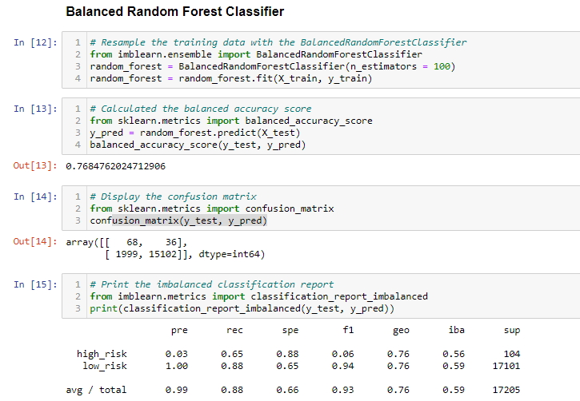

# Credit_Risk_Analysis
This module involved some machine learning and predictive analysis on credit risk.  Although not 100% accurate, providing credit always poses some sort of inherent risk.  Personal situations arise, variables keep changing on why the risk may be skewed between the time of the customer application, to the actual predictive nature on how one utilizes their credit upon awarding.  Too many variables can change one's intent to obtain credit and with the economy always growing and changing, it makes it that much more difficult.  However, with the appropriate tools my job as a Data Engineer is to evaluate the given data by building and evaluating models.  Two new machine learning models are utilized to reduce bias and to help predict and to help understand the risk invovled.

## List of required deliverables to help predict credit risk:
1. Utilize the Resampling Model and apply different algorithms if necessary to help predict outcomes
2. Use the SMOTEENN algorithm as another tool to aid in the predictions
3. In addition utilize the Ensemble Classifiers

## Random Over Sampler algorithm predictive model
The first model was created with the Naive Over Sampler method.  The results in Figure 1 depict that balanced accuracy test is 64.9%.  The precision for high_risk is at only 1%, and the recall is at 73%.  Recall is defined as how good a test is at detecting positive values.

### Figure 1

## SMOTE Oversampling algorithm
To increase the size of the minority, the next model was created with SMOTE (Synthetic Minority Oversampling Technique).  With this oversampling technique, the results indicate just a slightly higher accruracy at 66%.  The precision for high_risk is again limited.  The difference with this versus Random Oversampling is that new instances are interpolated, meaning new data points are created where some of their closest neighbors reside within the data.  By default the minority class size here would be equal to the majority.  Then the model is again trained to predict and accuracy is assessed.  SMOTE is utilized to reduce the risk of oversampling however similar to this case, this does not always outperform versus random oversampling as depicted in Figure1 (Random Oversampling) versus Figure2 (SMOTE).  SMOTE oversampling results: the accuracy score is 66.2%, the precision for the high_risk loans has a low positvity again at 1% with the recall at 69% overall.

### Figure 2

## Undersampling
Compared to the Oversampling, undersampling is another method that allows for the determination of the best performance when resampling data.  Here we can see the results: the balance accuracy score is 65.8%, the high_risk precision is again at a low 1% with a recall at 40% total.

### Figure 3

## SMOTEENN algorithm
SMOTEENN is a combination of SMOTE with Edited Nearest Neighbors algorithm.  Basically this is a two-step process combining the oversampling of the minority class with SMOTE and the cleansing of the resulting data with undersampling.  This will allow for a more distinct separation of the two classes.  The SMOTEENN results: balanced accuracy score is 54.4% the precision is 99% and the recall is 58% overall.

### Figure 4

## Balanced Random Forest Classifier
This is yet another algorithm utilized to combine multiple models to aid in the improvment of accuracy and robustness.  Here several decision trees are built to help predict the bad loan applications from this dataset.  Results of Balanced Random Forest Classifier: the accuracy score is 76.8% the precision is 99% and the recall is 88%

### Figure 5

## Easy Ensemble AdaBooster Classifier
The Easy Ensemble AdaBooster Classifier algorithm was utilized to train and retrain the model to minimize similar errors that occur through each training.  The results for this algorithm are: the accuracy score is 93.1% the precision is 99% and the recall is 88%.

### Figure 6

# Conclusion
In summary, when utilizing the first four models, oversampling, undersampling and a combination of both where utilized to predict the highest risk loans.  However in looking at the accuracy and it seems as though the outcome could have been better dependent upon using the right model.  And none of these seemed to be the 'right' model.  When I retrained the data with the final two models the results seemed to be more fitting.  Especially with the Easy Ensemble AdaBooster Classifier.  As you can see the accuracy, precision and recall are all at high scores and appears to be the best model to fit this dataset.